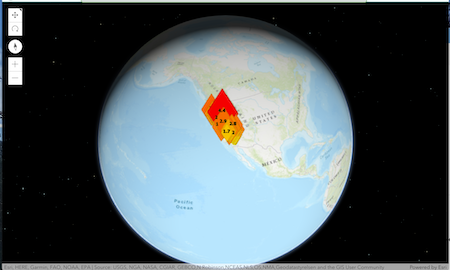

# 3d-viewer

3d Viewer is a configurable app template that allows you to create 3d apps that contain daylight, line of sight tool and an inset map

[View it live](https://www.arcgis.com/apps/instant/3dviewer/index.html)
​

## Features

1. Supports 3d widgets from the ArcGIS API for JavaScript include daylight, line of sight, slice. 

2. Display an optional inset map that synchronizes with the map map

## Instructions

1. Fork and then clone the repo.

2. Run `npm install`

3. Host on local web server.

4. Open web browser.

## Dependencies

This app requires the following npm modules to be installed in the directory that contains the app. 
1. [Application Base](https://www.npmjs.com/package/@esri/application-base-js)
2. [Calcite Componnents](https://www.npmjs.com/package/@esri/calcite-components)
3. [Configurable App Components](https://www.npmjs.com/package/@esri/configurable-app-components)
4. [Telemetry](https://www.npmjs.com/package/@esri/telemetry)

## Requirements

- Notepad or your favorite HTML editor
- Web browser with access to the Internet

## Resources

- [ArcGIS for JavaScript API Resource Center](http://help.arcgis.com/en/webapi/javascript/arcgis/index.html)
- [ArcGIS Blog](http://blogs.esri.com/esri/arcgis/)
- [twitter@esri](http://twitter.com/esri)

## Issues

Find a bug or want to request a new feature? Please let us know by submitting an issue.

## Contributing

Esri welcomes contributions from anyone and everyone. Please see our [guidelines for contributing](https://github.com/esri/contributing).

## Licensing

Copyright 2020 Esri

Licensed under the Apache License, Version 2.0 (the "License");
you may not use this file except in compliance with the License.
You may obtain a copy of the License at

http://www.apache.org/licenses/LICENSE-2.0

Unless required by applicable law or agreed to in writing, software
distributed under the License is distributed on an "AS IS" BASIS,
WITHOUT WARRANTIES OR CONDITIONS OF ANY KIND, either express or implied.
See the License for the specific language governing permissions and
limitations under the License.

A copy of the license is available in the repository's [license.txt](License.txt) file.

​